PC自作
====

PCを自作したい

# やりたい事別

## フルスタック

CPUを作って、OSを書いて、アプリケーションを書いて動かしたい。

CPUを作るのは、FPGAでいくか、いっそロジックICでやるか。

### 参考

#### [HomeBrewCPU](http://www.homebrewcpu.com/)

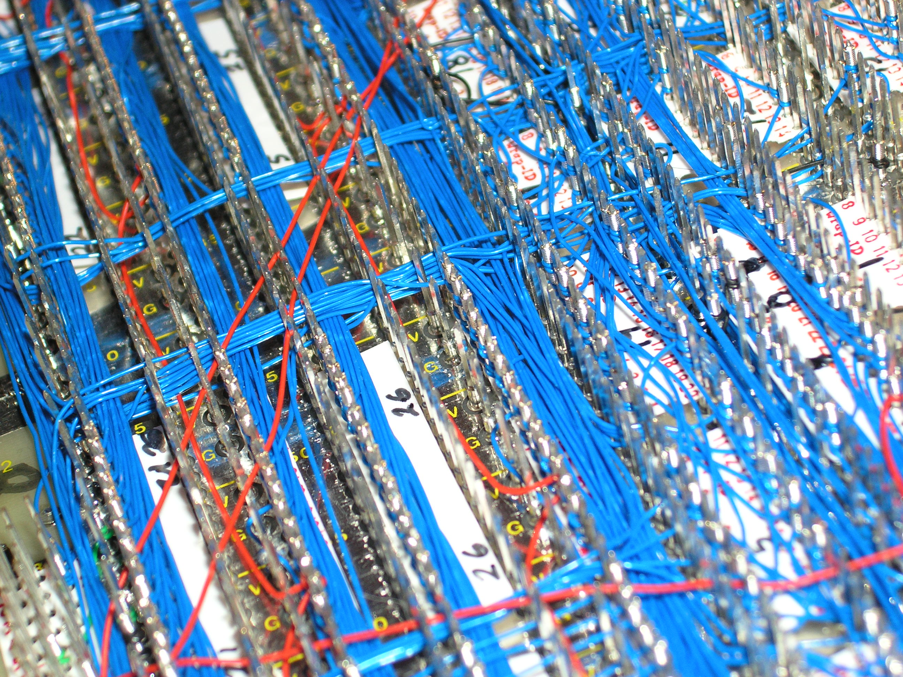

ワイヤーラッピングでCPUと周辺回路を作って、Cコンパイラを移植してminixを動かしてる。
すごい。

#### [MOnSter 6502](https://monster6502.com/)

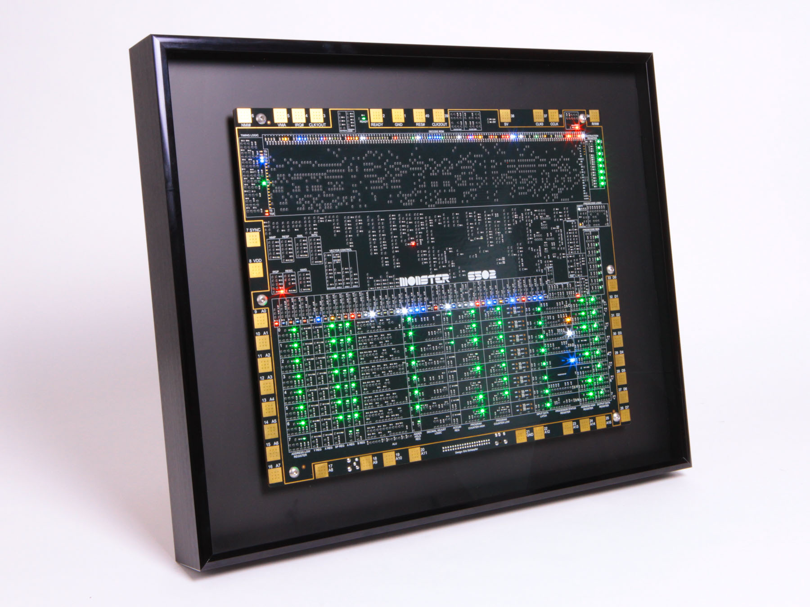

6502 CPUをトランジスタ群として自作。

#### [CPU実験で自作CPUにUNIXライクOS (xv6) を移植した話](http://nullpo-head.hateblo.jp/entry/2015/03/24/205419)
東大生は実験でCPUを作ってるらしい。
このバージョンは[XV6][xv6]を移植してるらしい。

[xv6]: http://ja.wikipedia.org/wiki/Xv6

#### FPGAベースのマシン群

## 執筆マシン

Pomeraはいいんだけど、ちょっとだけカスタマイズしたいし、Viがいい。

### 参考

#### [Pomera](https://www.kingjim.co.jp/pomera/)

ポメラ
CMであれもできません、これもできません、みたいな話をしてて、すばらしいと思った。

#### [FreeWrite](https://getfreewrite.com/)

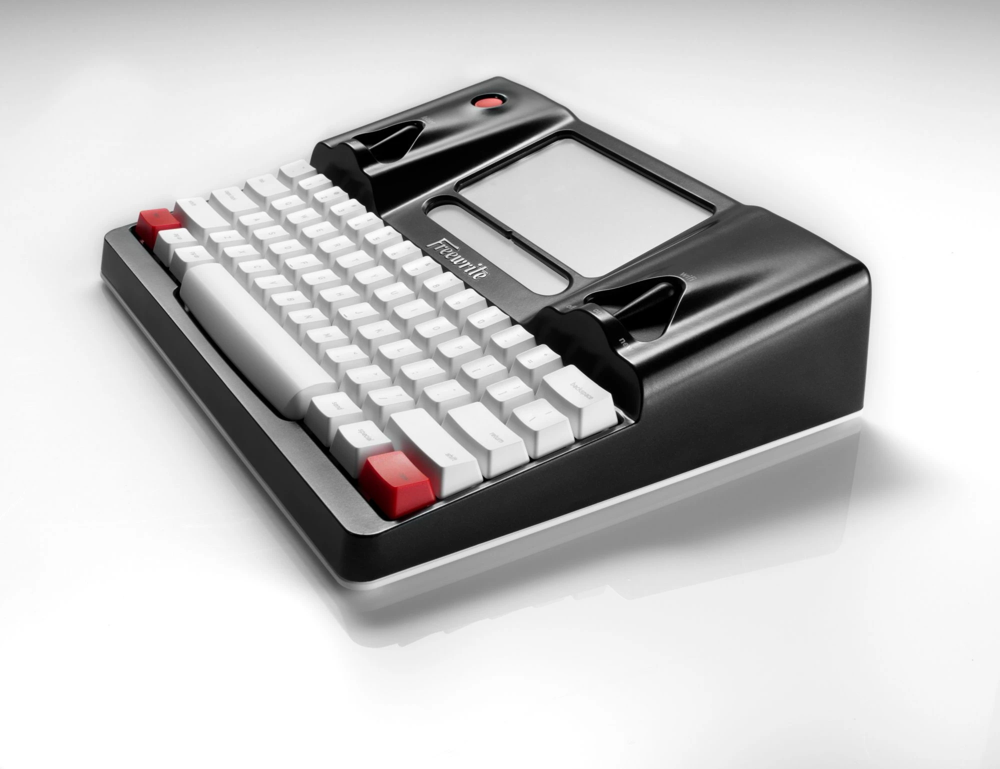

ペーパーディスプレイ + メカニカルキーボードのマシン

かな漢字変換があるとペーパーディスプレイは厳しそうだから、
日本語版を作るとすれば、漢直を覚える必要があるな。

#### [SPUDwrite](https://blog.adafruit.com/2019/02/14/the-spudwrite-single-purpose-user-device-for-creating-writing-made-with-e-paper-mbed-and-stm32f401-cortex-m4/)

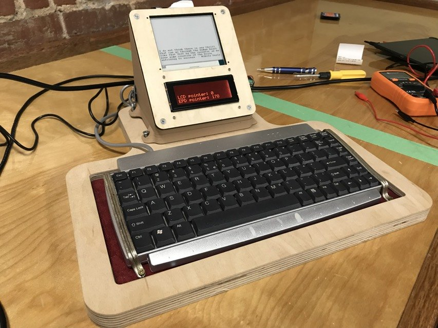

ペーパーディスプレイ + レシートプリンタ

自作っぽいやつ。

#### EmacsだけのLinux

リンクみつからないけど、
LinuxをX無しで起動して、
Emacsだけを起動するっていうアイディアが説明されてるのを見た。

## タブレット

enchantMoonはできる事が多すぎたんだと思うんだよ。
1つに絞ってそれしかできないマシンを作るといいと思う。

### 参考

#### [SDA - The best new PDA](https://hackaday.io/project/35165-sda-the-best-new-pda)

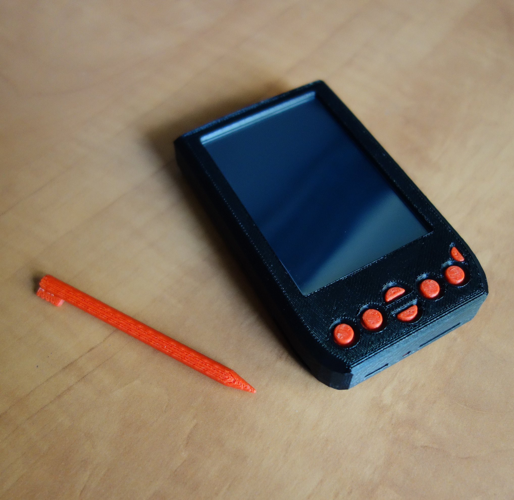

PalmPilotみたいな自作PDA

CPUはSTM32F4らしい

#### [Tema](http://www.todopic.com.ar/foros/index.php?topic=39080.0)

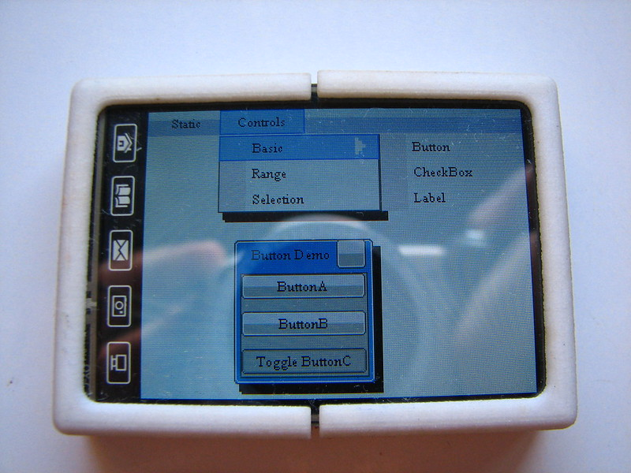

これも自作PDAだし、STM32F4

#### [enchantMOON](https://www.itmedia.co.jp/news/articles/1512/02/news066.html)

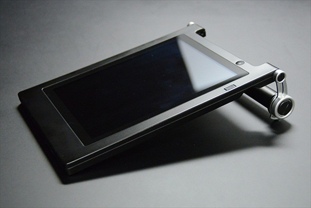

enchantMOON自体は、やりたいことは凄いわかるけど、いらない、と思って手を出さなかった。

## ゲーム機

(俺定義の)最高のゲーム機を作りたい。

オンマシンでゲーム作れるといいかな。

### 参考

#### [POCKET C.H.I.P](https://shop.pocketchip.co/pages/about)

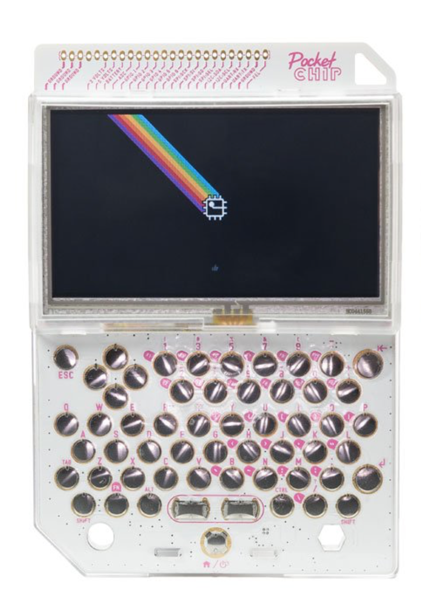

PICO-8マシン。

なんだけど、
買った時は、それが良く理解できてなかったし、
結局Linuxマシンでしょってなってしまう。

#### [CHIP-8](https://en.wikipedia.org/wiki/CHIP-8)

70年代に作られたファンタジーコンソールらしい。

#### [Fantasy console](https://paladin-t.github.io/fantasy/index)

俺が考えた最強のゲーム機を作る、というムーブメント
ただし、ソフトウエアだけの人が多い。

# フォームファクターごと

## クラムシェル

作って人に見せてまわるなら、
クラムシェルが一番よさそう。
設計が難しそう。
ヒンジをどう処理するか。

### 参考

#### [RasPSION](https://makezine.jp/blog/2016/07/raspsion.html)

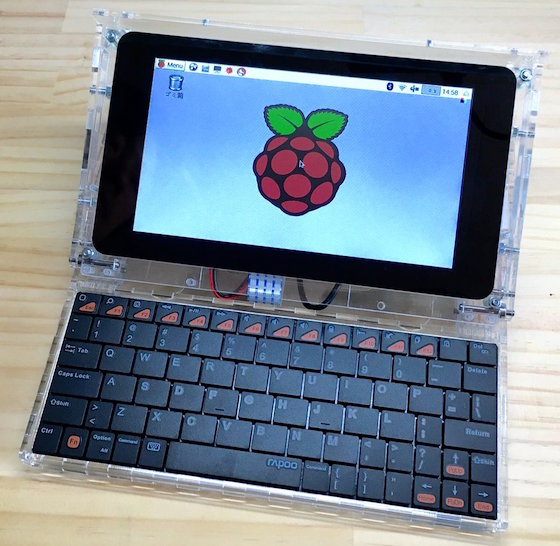

RasPiを入れるPSION型の機体

#### [ZX SPECTRUM NEXT LAPTOP](https://www.dorchester3d.com/printing/blog/2018/01/zx-spectrum-next-laptop)

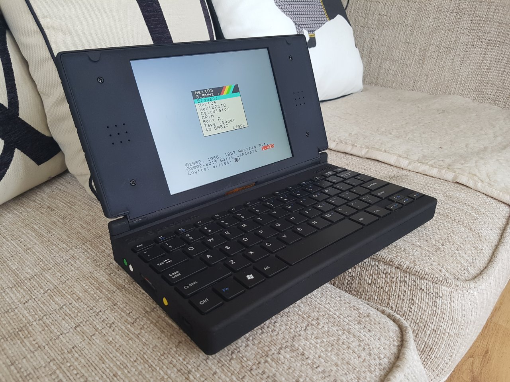

クオリティ高めのRasPi筐体

## ハンドヘルドコンピュータ

クラムシェル型のコンピュータは設計が難しい。
そこを簡単にしたら、ハンドヘルド型になった。
作ってみた感じだと、画面の視野角が厳しい。

### 参考

#### [PC-8201](https://ja.wikipedia.org/wiki/PC-8200%E3%82%B7%E3%83%AA%E3%83%BC%E3%82%BA)

1983年発売。
ハンンドヘルドコンピュータと言えばこれかな。

#### [6502 HOME COMPUTER](https://www.grappendorf.net/projects/6502-home-computer/)

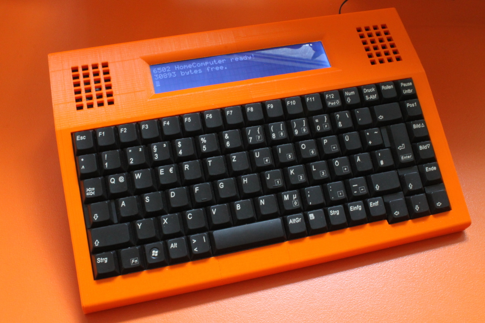

6502が入った自作ハンドヘルド

## ポケコン

ハンドヘルドを更に推し進めていくとポケコンになりそう

### 参考

## アルミケース型

クラムシェル型の問題は設計が難しい事だけど、
設計の自由度を下げてやれば自由と引き換えに、
設計が簡単になると思う。
外半分を自由にしたら、設計は2面だけになる。

### 参考

#### [『2001年宇宙の旅』でフロイド博士用にハネウェル社がデザインしたラップトップPC](https://twitter.com/KubrickBlogjp/status/1045603252195086336/photo/1)

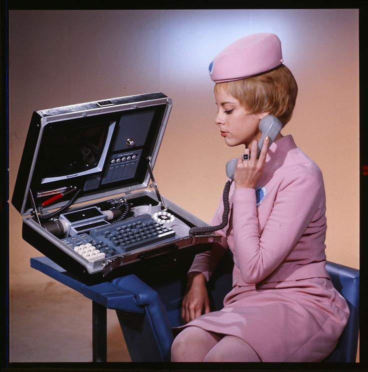

    『2001年宇宙の旅』でフロイド博士用にハネウェル社がデザインしたラップトップPC。
    カメラ、電子スタイラスペン、モデム、キーボード、デジタルファイルストレージ、
    ディスプレイを装備。1968年当時の「未来のコンピュータ」。

夢がある

#### [The Raspberry Pi Recovery Kit](https://back7.co/home/raspberry-pi-recovery-kit)

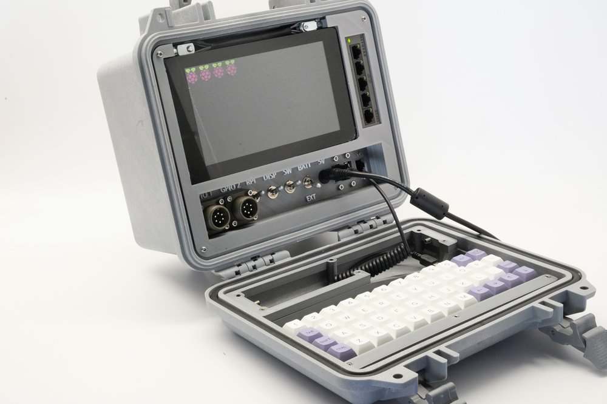

防水ケースにRasPiを詰め込んだ作品。

## ポータブルコンピュータ

アルミケース型は、ちょうどいいサイズのケースを探すのが難しかった。
もうちょい簡単なのとしてポータブルコンピュータはどうだろうか。

### 参考

#### [Osbone 1](https://ja.wikipedia.org/wiki/Osborne_1)

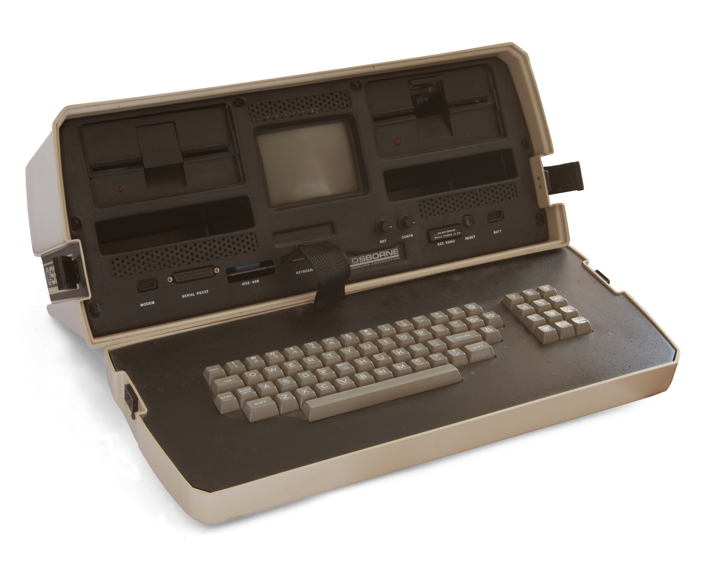

世界初のポータブルコンピュータ

#### [Raspberry Pi 4 Commodore SX-64 Inspired Portable Computer](https://www.element14.com/community/docs/DOC-94098/l/episode-421-raspberry-pi-4-commodore-sx-64-inspired-portable-computer)

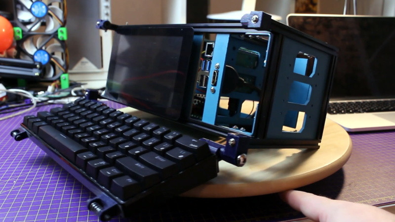

アルミフレーム(20x20)を使った筐体。

#### [Reviiser](https://reviiser.com/reviiser-v1-cyberdeck-update.html)

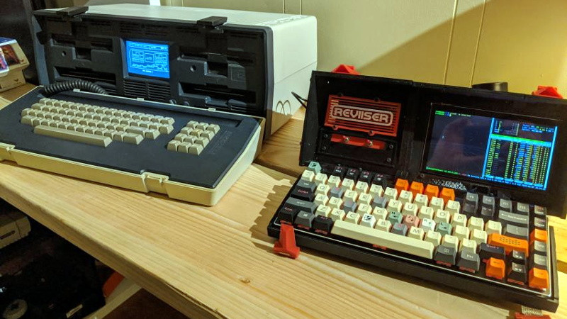

全体が3Dプリントされた筐体。
